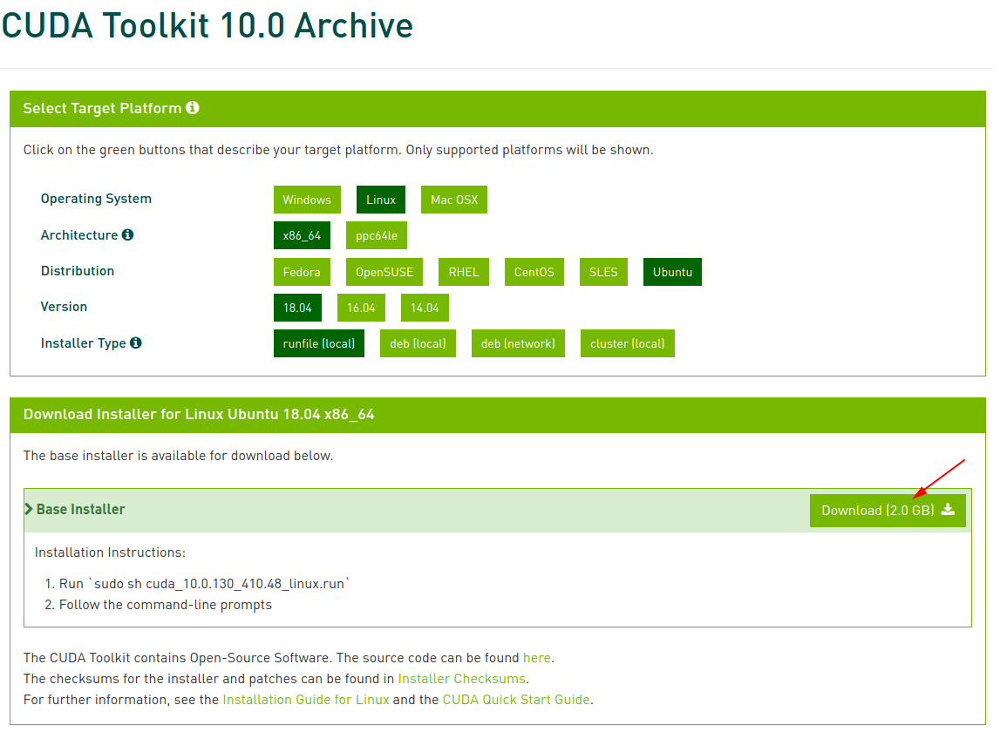
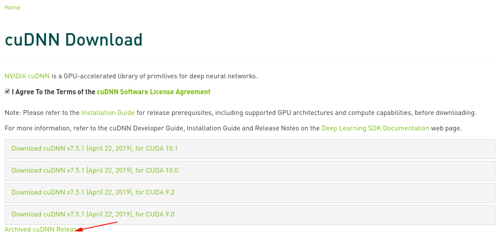
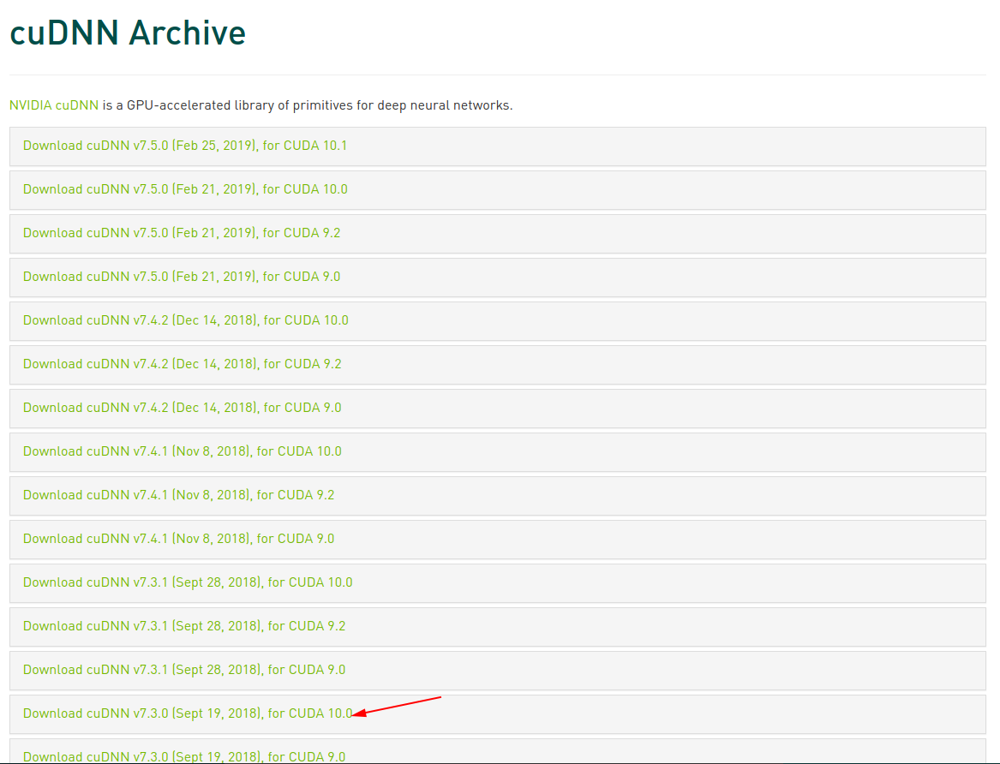

# Tensorflow安装
---
> 系统环境 Xubuntu 18.04

## 1. NVIDIA显卡驱动及CUDA安装
首先进入cuda 10.0[下载地址](https://developer.nvidia.com/cuda-10.0-download-archive)。依次选择，Linux -> x86_64 -> Ubuntu -> 18.04 -> runfile(loacal)，然后点击Download。如下图所示

图1

## 2. cudnn安装
- 进入[cudnn主页](https://developer.nvidia.com/cudnn)，点击右上角的Join进行账号注册，注册完成登录。登录界面如图2所示。
- 登录完成之后选择 Download cuDNN，如图3所示
- 下载cuDNN v7.3.0 Library for Linux，如图4~图7所示

图2

图3

图4

图5

图6

图7

## 3. tensorflow 2.0 v2.0.0-alpha0 安装