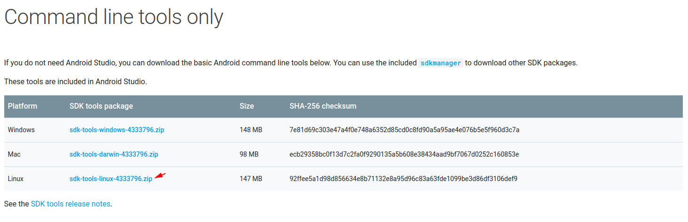
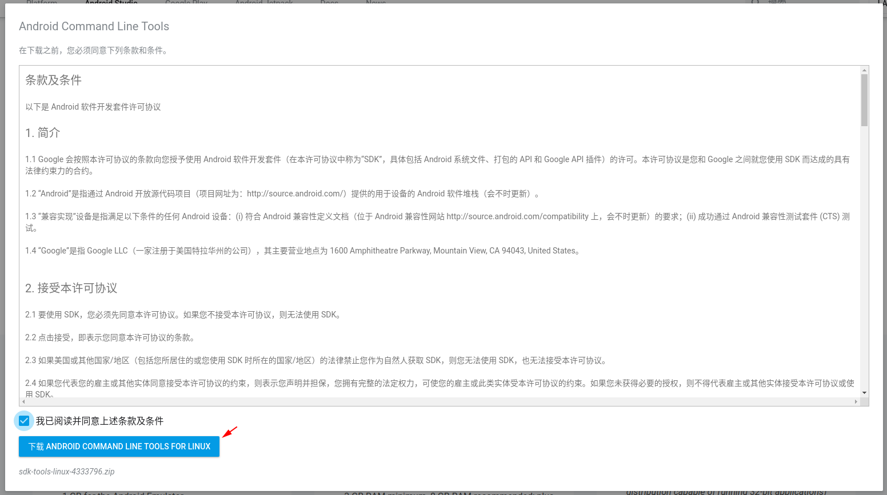
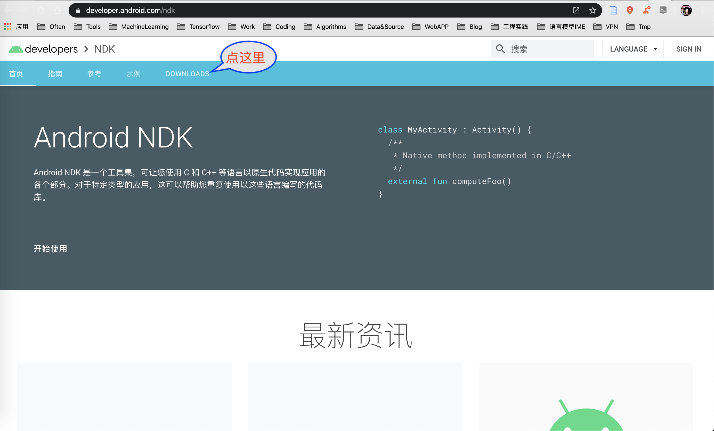
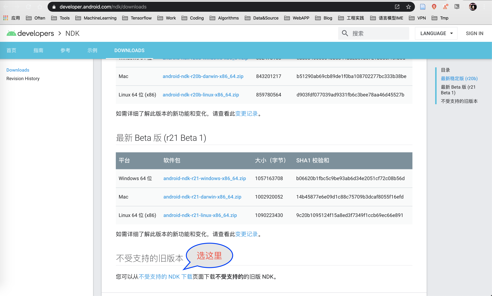
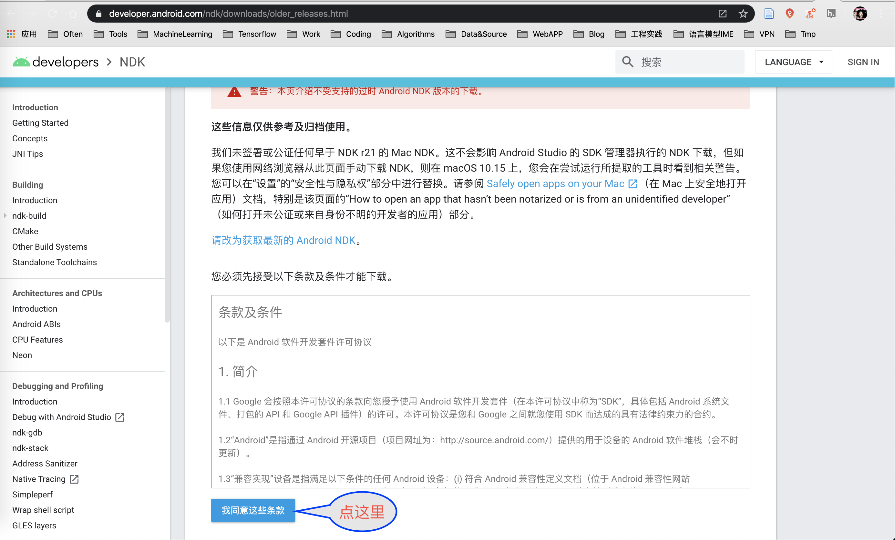
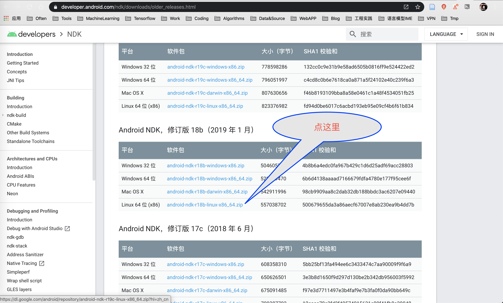

# Tensorflow Lite 编译环境配置
---

## 1. 配置Android SDK
> 注意：本文默认配置在用户主目录下的android/sdk/

**参考**
> - [使用sdkmanager命令行工具安装Android SDK](https://majing.io/posts/10000004651173)

#### 1. 进入官网，下载sdk-tools-linux

进入[Android](https://developer.android.com/studio)官网-- 如图1，定位到`Command line tools only` -- 如图2，下载`sdk-tools-linux-4333796.zip` -- 需要先同意，如图3。

图1 -- Android官网

图2 -- sdk-tools-linux

图3 -- 同意条款

***也可以使用如下命令***

	wget -c "https://dl.google.com/android/repository/sdk-tools-linux-4333796.zip"

#### 2. 解压工具包，安装所需环境。

**需要安装的包列表**	

- build-tools;21.1.2 
- build-tools;23.0.1 
- build-tools;23.0.2
- build-tools;23.0.3
- build-tools;26.0.2
- build-tools;27.0.1
- build-tools;28.0.3
- emulator
- extras;android;m2repository
- extras;google;m2repository
- extras;intel;Hardware_Accelerated_Execution_Manager
- patcher;v4
- platform-tools
- platforms;android-21
- platforms;android-23
- platforms;android-26
- platforms;android-28
- sources;android-21
- sources;android-23
- sources;android-26
- sources;android-28
- tools

**解压安装**

	# 替换成你自己的download_dir和home_dir
	cp ${download_dir}/sdk-tools-linux-4333796.zip ${home_dir}/android/sdk/
	cd ${home_dir}/android/sdk/
	unzip -x sdk-tools-linux-4333796.zip
	
	./tools/bin/sdkmanager "build-tools;21.1.2" "build-tools;23.0.1" "build-tools;23.0.2" \
	"build-tools;23.0.3" "build-tools;26.0.2" "build-tools;27.0.1" "build-tools;28.0.3" \
	"emulator" "extras;android;m2repository" "extras;google;m2repository" "patcher;v4" \
	"platform-tools" "platforms;android-21" "platforms;android-23" "platforms;android-26" \
	"platforms;android-28" "sources;android-21" "sources;android-23" \
	"sources;android-26" "sources;android-28" "tools"

## 2. 配置Android NDK
> 注意：本文默认配置在用户主目录下的android/ndk/

#### 1. 下载`android-ndk-r18b-linux-x86_64.zip`
进入[Android NDK](https://developer.android.com/ndk)官网，下载`android-ndk-r18b-linux-x86_64.zip`，依次如下图所示。

**也可以通过如下命令下载**

	wget -c "https://dl.google.com/android/repository/android-ndk-r18b-linux-x86_64.zip?hl=zh_cn"
	mv "android-ndk-r18b-linux-x86_64.zip?hl=zh_cn" android-ndk-r18b-linux-x86_64.zip

#### 2. 解压

	cp ${download_dir}/android-ndk-r18b-linux-x86_64.zip ${home_dir}/android/sdk/
	unzip -x android-ndk-r18b-linux-x86_64.zip

## 3. 配置bazel
> 默认安装在用户目录，即采用--user, 也可以不添加该参数root安装。

#### 1. 下载
	
	wget -c "https://github.com/bazelbuild/bazel/releases/download/0.26.1/bazel-0.26.1-installer-linux-x86_64.sh"

#### 2. 安装

	chmod a+x bazel-0.26.1-installer-linux-x86_64.sh
	./bazel-0.26.1-installer-linux-x86_64.sh --user
	
#### 3. 查看是否安装成功

	bazel version

**显示如下内容，安装成功**

	Build label: 0.26.1
	Build target: bazel-out/k8-opt/bin/src/main/java/com/google/devtools/build/lib/bazel/BazelServer_deploy.jar
	Build time: Thu Jun 6 11:05:05 2019 (1559819105)
	Build timestamp: 1559819105
	Build timestamp as int: 1559819105