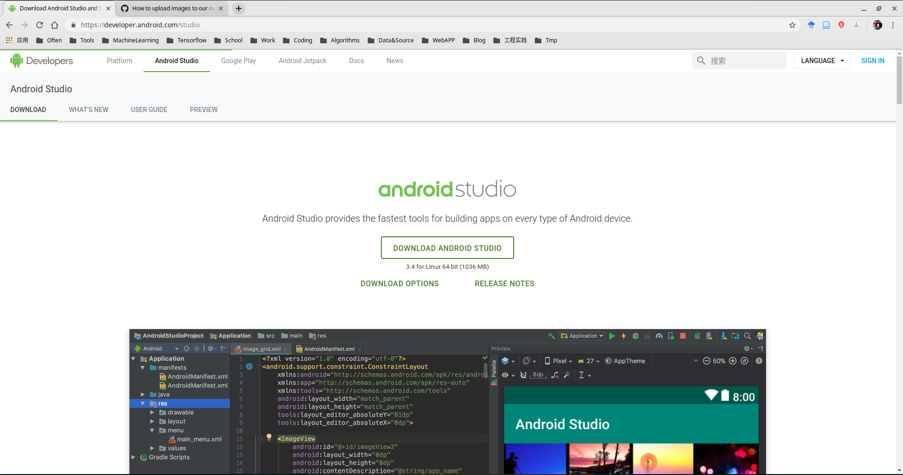
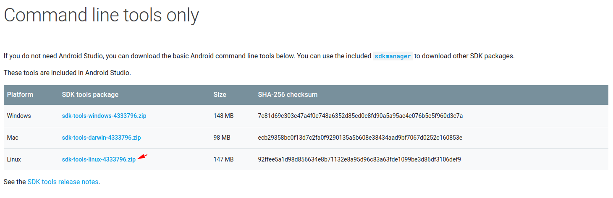
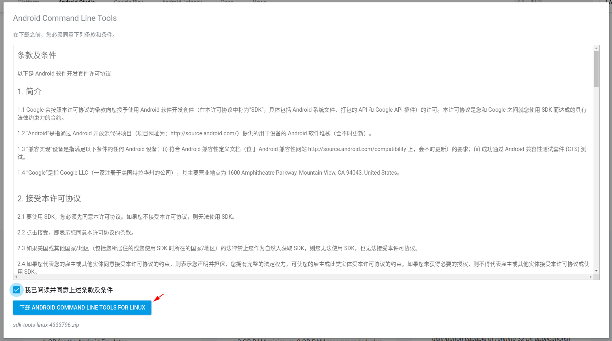

# Tensorflow Lite 编译环境配置

## 1. 配置Android SDK

#### 参考
> - [使用sdkmanager命令行工具安装Android SDK](https://majing.io/posts/10000004651173)

#### 配置过程

- 进入[Android官网](https://developer.android.com/studio) -- 如图1，定位到`Command line tools only` -- 如图2，下载`sdk-tools-linux-4333796.zip` -- 需要先同意，如图3。也可在命令行用如下命令。

		wget -c "https://dl.google.com/android/repository/sdk-tools-linux-4333796.zip"

- 解压`sdk-tools-linux-4333796.zip`

		unzip -x sdk-tools-linux-4333796.zip
		
- 安装环境；需要安装如下包

		build-tools;21.1.2 
		build-tools;23.0.1 
		build-tools;23.0.2
		build-tools;23.0.3
		build-tools;26.0.2
		build-tools;27.0.1
		build-tools;28.0.3
		emulator
		extras;android;m2repository
		extras;google;m2repository
		extras;intel;Hardware_Accelerated_Execution_Manager
		patcher;v4
		platform-tools
		platforms;android-21
		platforms;android-23
		platforms;android-26
		platforms;android-28
		sources;android-21
		sources;android-23
		sources;android-26
		sources;android-28
		tools

		./tools/bin/sdkmanager "build-tools;21.1.2" "build-tools;23.0.1" "build-tools;23.0.2" "build-tools;23.0.3" "build-tools;26.0.2" "build-tools;27.0.1" "build-tools;28.0.3" "emulator" "extras;android;m2repository" "extras;google;m2repository" "patcher;v4" "platform-tools" "platforms;android-21" "platforms;android-23" "platforms;android-26" "platforms;android-28" "sources;android-21" "sources;android-23" "sources;android-26" "sources;android-28" "tools"

图1

图2

图3

## 2. 配置Android NDK

## 3. 配置bazel