# Tensorflow安装
---
> 本节系统环境 Xubuntu 18.04

**本节要点：**

- CUDA安装
- cuDNN安装
- Tensorflow 2.0安装

## 1. CUDA安装
**第一步：下载CUDA 10.0**

访问[**下载地址**](https://developer.nvidia.com/cuda-10.0-download-archive)。依次选择，**Linux -> x86_64 -> Ubuntu -> 18.04 -> runfile(loacal)**，然后点击**Download**。如下图1-1所示：

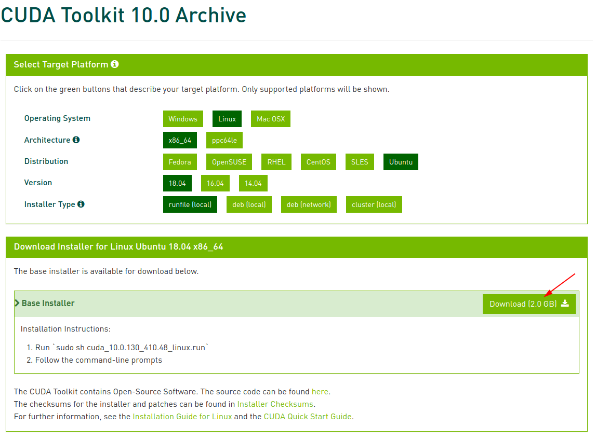

图1-1

**第二步：安装CUDA**

同时按住`CTRL + ALT + F1`, 登录root账户。

关闭`lightdm`，使用如下命令查看`lightdm`状态及关闭`lightdm`。

	sudo service lightdm status
	sudo service lightdm stop

见图1-2，图1-3所示。

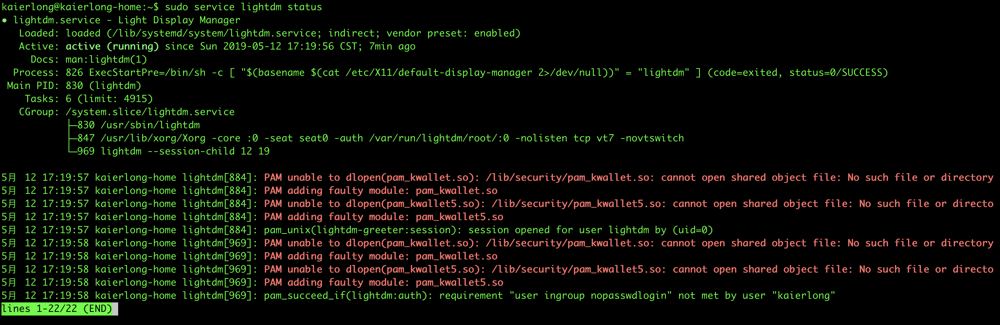

图1-2

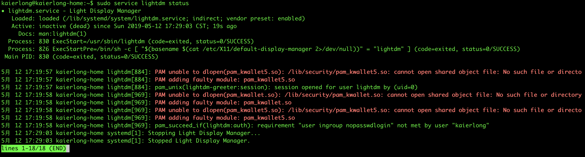

图1-3

	
安装
	
	sudo ./cuda_10.0.130_410.48_linux

见图1-4到图1-6。

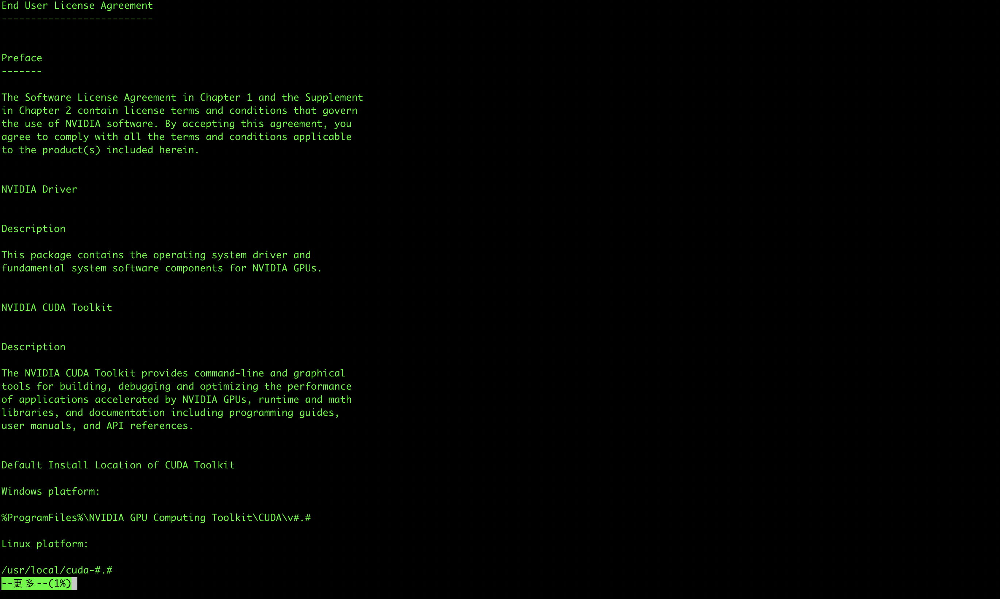

图1-4

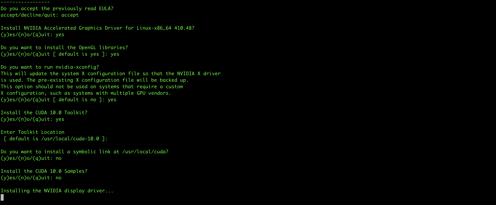

图1-5

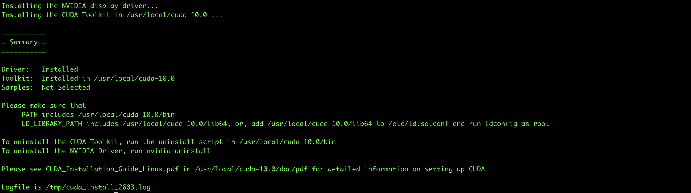

图1-6

**第三步：系统环境配置**

## 2. cuDNN安装

**第一步：下载cuDNN**

- 进入[**cudnn主页**](https://developer.nvidia.com/cudnn)，点击右上角的Join进行账号注册 -- 此处略。
- 登录已注册账号。登录界面如图2-1所示。
- 登录完成之后选择`Download cuDNN`，如图2-2所示。
- 下载`cuDNN v7.6.0 Library for Linux`，如图2-3~图2-6所示。

图2-1 登录界面

图2-2 下载界面

图2-3 同意条款

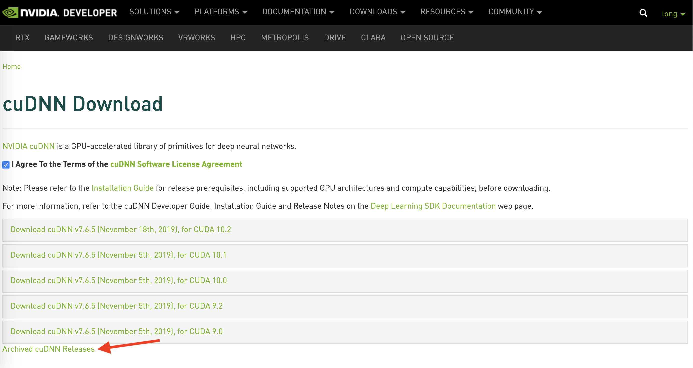

图2-4 存档版本

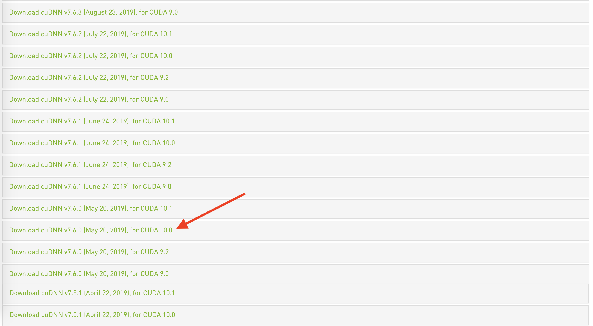

图2-5 确认版本

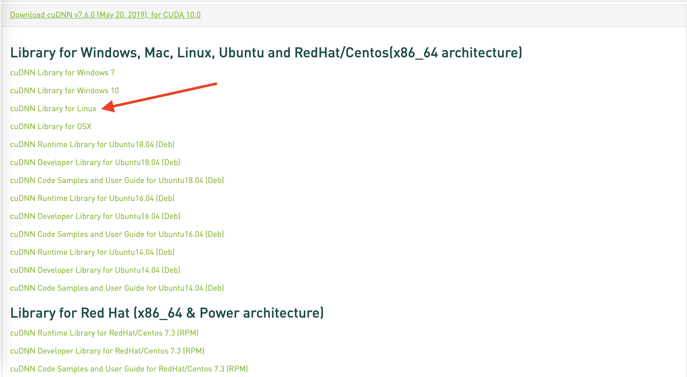

图2-6 确认平台

**第二步：安装cuDNN**
> 本次cuda安装位置为**`/usr/local/cuda-10.0`**

**查看cuDNN是否已安装，参见图2-7、图2-8，可以看到里面并有`cudnn`相关文件。运行如下命令，进行安装：**

	tar -zxvf cudnn-10.0-linux-x64-v7.6.0.64.tar  # 解压得到cuda文件夹
	sudo cp cuda/include/cudnn.h /usr/local/cuda-10.0/include/
	sudo cp cuda/lib64/libcudnn.so.7.6.3 /usr/local/cuda-10.0/lib64/
	cd /usr/local/cuda-10.0/lib64/
	sudo ln -s libcudnn.so.7.6.0 libcudnn.so.7
	sudo ln -s libcudnn.so.7 libcudnn.so
	
**确认cuDNN已安装**
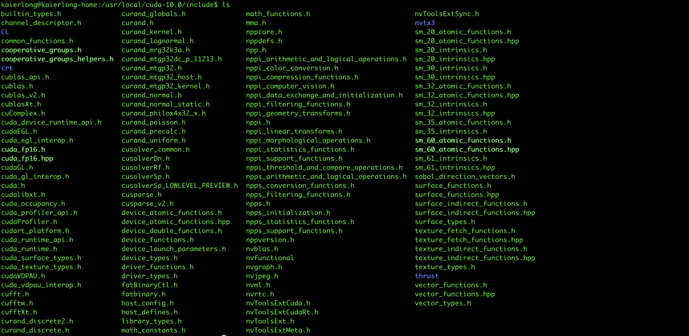

图2-7 安装前include文件夹

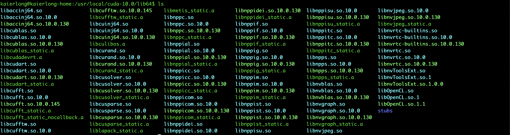

图2-8 安装前lib64文件夹

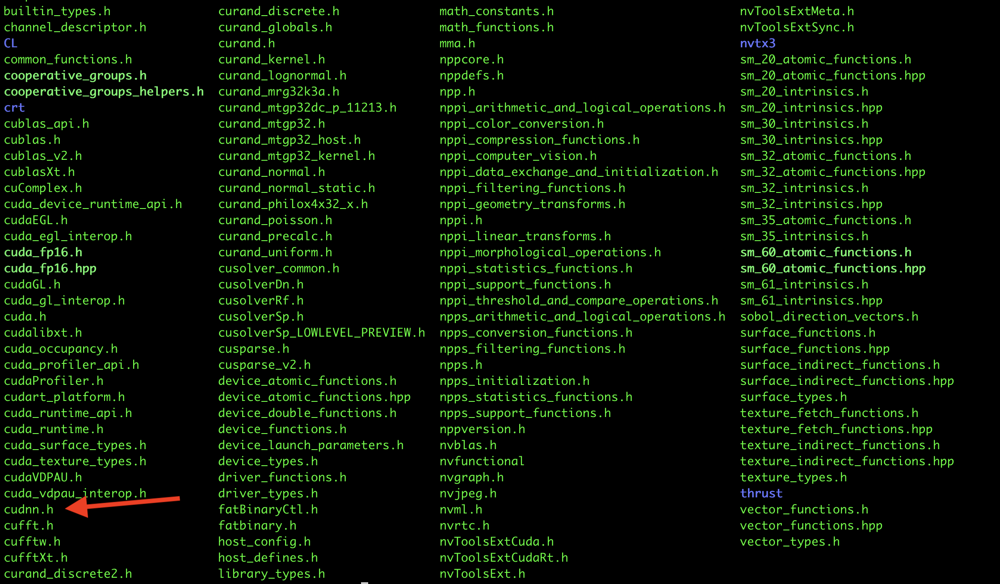

图2-9 安装后include文件夹

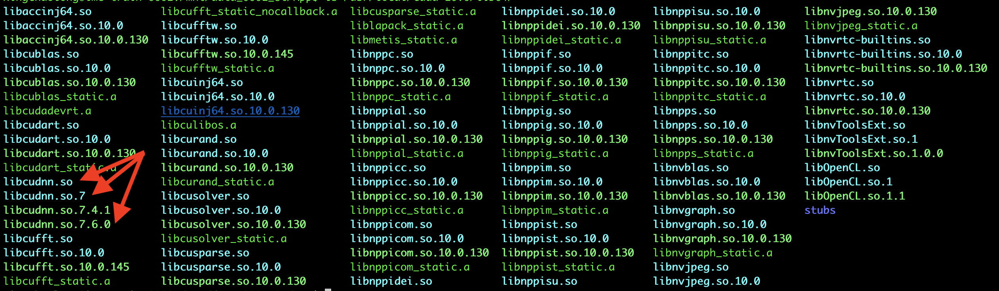

图2-10 安装后lib64文件夹

## 3. Tensorflow 2.0 安装
**安装Tensorflow 2.0**

	sudo pip3 install tensorflow==2.0.0
	sudo pip3 install tensorflow-gpu=2.0.0
	
**测试是否安装成功**

	python3
	
**显示如下内容：**

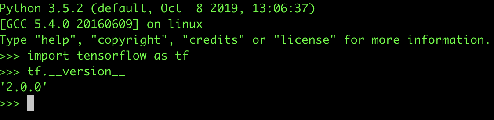

图3-1 安装成功

**安装成功！**