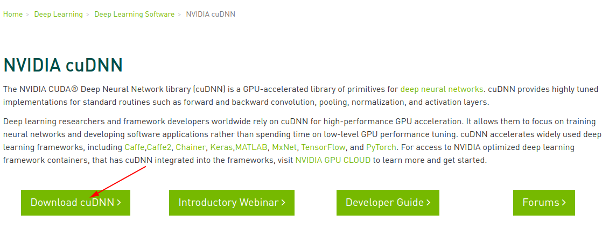

# Tensorflow安装
---
> 本节系统环境 Xubuntu 18.04

**本节要点：**

- CUDA安装
- cuDNN安装
- Tensorflow 2.0安装

## 1. CUDA安装
**下载CUDA 10.0**

访问[**下载地址**](https://developer.nvidia.com/cuda-10.0-download-archive)。依次选择，Linux -> x86_64 -> Ubuntu -> 18.04 -> runfile(loacal)，然后点击Download。如下图1所示

图1-1

**安装CUDA**

同时按住`CTRL + ALT + F1`, 登录root账户

关闭`lightdm`

	sudo service lightdm status
	sudo service lightdm stop

图1-2

## 2. cuDNN安装

#### 1. 下载cuDNN

- 进入[cudnn主页](https://developer.nvidia.com/cudnn)，点击右上角的Join进行账号注册，注册完成登录。登录界面如图2-1所示。
- 登录完成之后选择 Download cuDNN，如图2-2所示
- 下载cuDNN v7.3.0 Library for Linux，如图2-3~图2-6所示

图2-1

图2-2

图2-3

图2-4

图2-5

图2-6

#### 2. 安装cuDNN

## 3. Tensorflow 2.0 安装
**安装Tensorflow 2.0**

	sudo pip3 install tensorflow==2.0.0
	sudo pip3 install tensorflow-gpu=2.0.0
	
**测试是否安装成功**

	python3
	
**显示如下内容：**

**安装成功！**