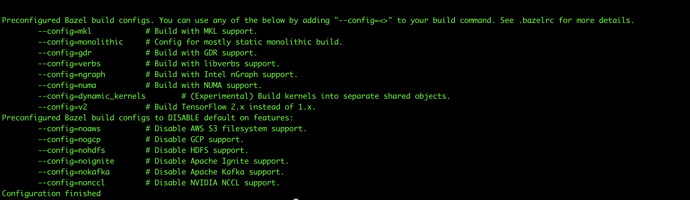

# minimal and benchmark
---
> 参考

- [tensorflow lite with ndk 17 compilatoin failed #20192](https://github.com/tensorflow/tensorflow/issues/20192)  
- [TFLite benchmark_model cannot be compiled successfully](https://github.com/tensorflow/tensorflow/issues/23068)
- [性能跑分](https://www.tensorflow.org/lite/performance/benchmarks?hl=zh-cn)
- [在 MAC OS X 安装 ADB (Android调试桥)](https://cloud.tencent.com/developer/article/1153846)
- [error: cannot find -lGLESv3 解决](https://blog.csdn.net/flycatdeng/article/details/83059211)
- [在Ubuntu 18.04/Linux Mint 19上安装ADB和Fastboot的方法](https://ywnz.com/linuxsj/4387.html)

## 0. 下载`tensorflow`源码，并定位到`v2.0.0`分支

	git clone https://github.com/tensorflow/tensorflow.git
	git tag
	git checkout v2.0.0
	git branch -a

## 1. 生成`.tf_configure.bazelrc`

**运行配置脚本**，具体情况如下图所示。

	./configure
	

**查看`.tf_configure.bazelrc`**

	cat .tf_configure.bazelrc

**修改`.tf_configure.bazelrc`**
> 将`ANDROID_NDK_API_LEVEL` 修改为 21

## 2. minimal

	bazel build tensorflow/lite/examples/minimal:minimal
	bazel-bin/tensorflow/lite/examples/minimal/minimal

## 3. benchmark

#### 1. 不同平台编译

**桌面平台**

	bazel build -c opt tensorflow/lite/tools/benchmark:benchmark_model

**arm_v7平台**

	bazel build -c opt --config=android_arm --cxxopt='--std=c++11' tensorflow/lite/tools/benchmark:benchmark_model --verbose_failures

**arm_v8平台**

	bazel build -c opt --config=android_arm64 --cxxopt='--std=c++11' tensorflow/lite/tools/benchmark:benchmark_model --verbose_failures
	
**编译结果文件为`bazel-bin/tensorflow/lite/tools/benchmark/benchmark_model`**

#### 2. 测试`mobilenet_v1`

**下载`mobilenet_v1`，解压**

	wget -c "https://storage.googleapis.com/download.tensorflow.org/models/tflite/mobilenet_v1_224_android_quant_2017_11_08.zip"
	unzip -x mobilenet_v1_224_android_quant_2017_11_08.zip
	
解压得到`labels.txt`和`mobilenet_quant_v1_224.tflite`，其中`mobilenet_quant_v1_224.tflite`是我们本次需要的。

**传输所需文件到手机**

	adb push bazel-bin/tensorflow/lite/tools/benchmark/benchmark_model /data/local/tmp
	adb mobilenet_quant_v1_224.tflite /data/local/tmp
	
**手机端测试**

	adb shell chmod +x /data/local/tmp/benchmark_model
	
	adb shell /data/local/tmp/benchmark_model \
	--graph=/data/local/tmp/mobilenet_quant_v1_224.tflite \
	--num_threads=4

